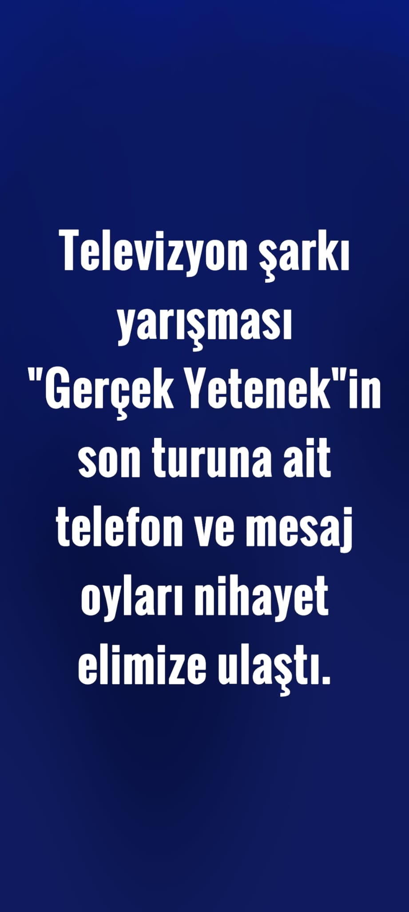
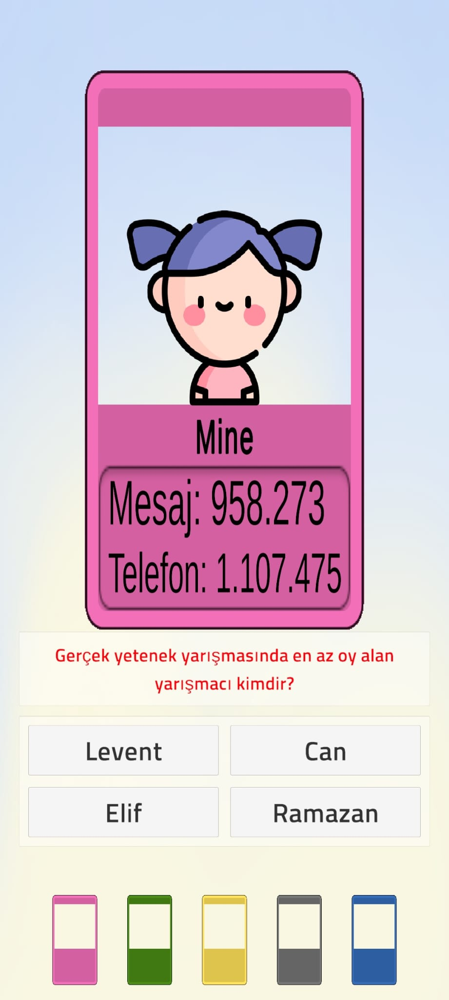
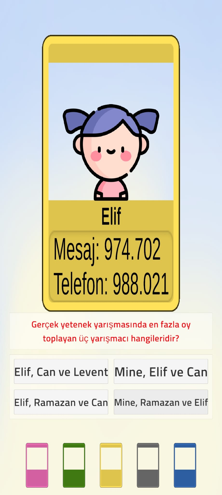
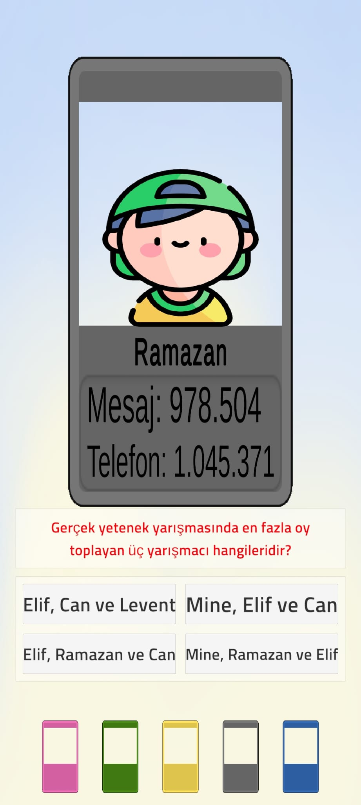
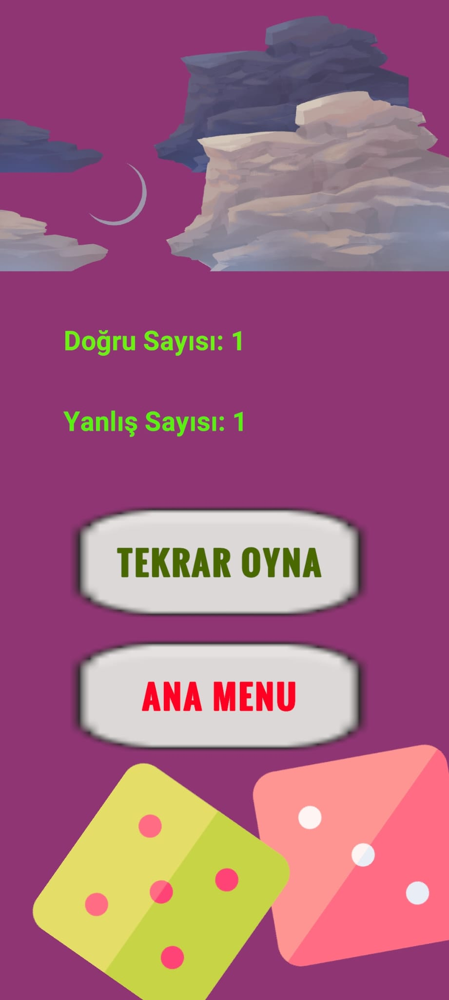

# GERÇEK YETENEK
Bu proje, Doğukan Özcan tarafından Fırat Üniversitesi Yazılım Mühendisliği Güncel Konular dersi vizesi için geliştirilen bir proje mobil oyunudur. Oyunun adı 'Gerçek Yetenek' olarak belirlenmiştir ve 'Mobil' platformda çalışmaktadır.
## Kullandığım programlar ve diller
- Unity
- Visual Studio 2019
- C#

## Oyun amacı
- Verilen oyları istenilen soruya göre işleme sokarak her yarışmacı için sonuçlar bulmak
- Yarışmacılar arasında geçiş yapma
- Sonucu görüntüleme
- Verilen konuya uygunluk
- Hitap etmesi gereken kitleye uygunluk
## Özellikler
- Zeka geliştirici matematik soruları
- Gelişim çağında etki gösteren
- İşlem yapma yeteneklerini geliştirmek için güçlendirmeler
- Sonuç ekranıyla analiz
- Oyun içi ses
## Video
<a href="https://drive.google.com/file/d/1t55dxM5EHKcoJScgib2s8KpGKDxrmkSb/view?usp=sharing" target="_blank" onclick="window.open('https://drive.google.com/file/d/1t55dxM5EHKcoJScgib2s8KpGKDxrmkSb/view?usp=sharing'); return false;">Tanıtım için tıklayın</a> (Aynı zamanda 'videos' klasöründen erişilebilir)

### Oyun içerisinden görüntüler
     
